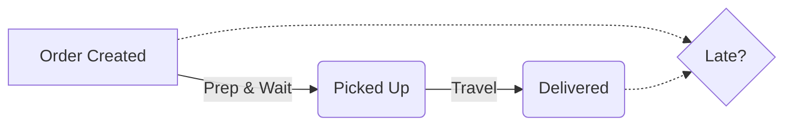

# FlashEats - Final Evidence Dashboard

## Core Metrics
| Metric | Value | Description |
|---|---|---|
| **Total Delivered Orders** | 1,535 | The total volume of completed orders analyzed. |
| **Percentage of Late Deliveries** | 54.98% | The percentage of orders where actual delivery time > promised ETA. |
| **Average Delay (Minutes)** | 10.51 | The average number of minutes an order is late (for late orders only). |
| **Average Prep & Wait Time** | 27.69 mins | Time from Order Creation to Pick Up. |
| **Average Travel Time** | 45.63 mins | Time from Pick Up to Delivery. |

## Workflow Diagram

## Knowns, Unknowns, Assumptions, and Limitations

### Knowns
- We know exactly when an order was created, when a driver picked it up, and when it was delivered.
- We know the promised ETA given to the customer.
- We know if drivers were reassigned.

### Unknowns
- **Restaurant preparation vs. driver wait time:** We only have `ORDER_CREATED` and `PICKED_UP`. We cannot confidently split this into "time the food took to make" vs "time the driver waited at the restaurant".
- **Traffic and Weather Data at granular levels:** The data provides buckets (e.g. `weather_bucket`) but not exact conditions at the moment of the delivery.

### Assumptions
- **Order Scope:** We assume we only care about `DELIVERED` orders to calculate lateness. Canceled orders are excluded as they don't have a final delivery time.
- **Timestamp Accuracy:** We assume the event timestamps accurately reflect physical reality (e.g., driver didn't forget to swipe "delivered" until 10 mins later).

### Limitations
- The `restaurant_status.csv` contains dirty data (e.g., "Ready", "ready ", "handoff") and wasn't cleanly joinable without extensive NLP/cleaning steps.
- The dispatch API data only gives snapshots. We have to reconstruct the state from event logs.

## Recommendation FDE Slide
- **Actionable Takeaway:** Based on the output of the data pipeline, look at the ratio of **Prep & Wait Time** vs **Travel Time**. If prep is the bottleneck, an AI system predicting delays won't fix kitchen operations. Instead, we should implement kitchen throttling. If travel time is the bottleneck, routing optimizations and AI ETA prediction are more viable.
