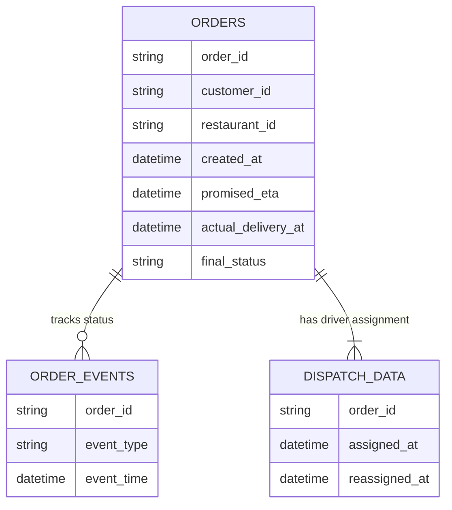

# Source Map & Workflow

## Business Question
**Why are deliveries late, and where does the delay accumulate?**

## Information Required -> Source Systems
1. **Order Timings & Status** -> `flasheats.db` (SQLite `orders` table)
   - *Grain:* 1 row per order
   - *Ownership:* Core Platform
2. **Event Workflows (Created, Picked Up, Delivered)** -> `order_events.csv`
   - *Grain:* 1 row per event per order
   - *Ownership:* Event Logging System
3. **Dispatch & Reassignment Data** -> Mock Dispatch API (`/dispatch/orders`)
   - *Grain:* 1 record per order (paginated)
   - *Ownership:* Dispatch / Logistics Team

## Data Model & Workflow Diagram

## Important Gaps
1. We cannot separate "Kitchen Prep Time" from "Driver Wait Time" because the only events logged are `ORDER_CREATED` and `PICKED_UP`. A `READY_FOR_PICKUP` event would close this gap.
2. We lack real-time geographical data (traffic/weather points) at the exact time of delivery to pinpoint external delay factors accurately.
